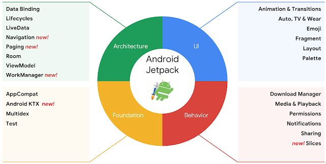
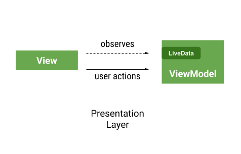
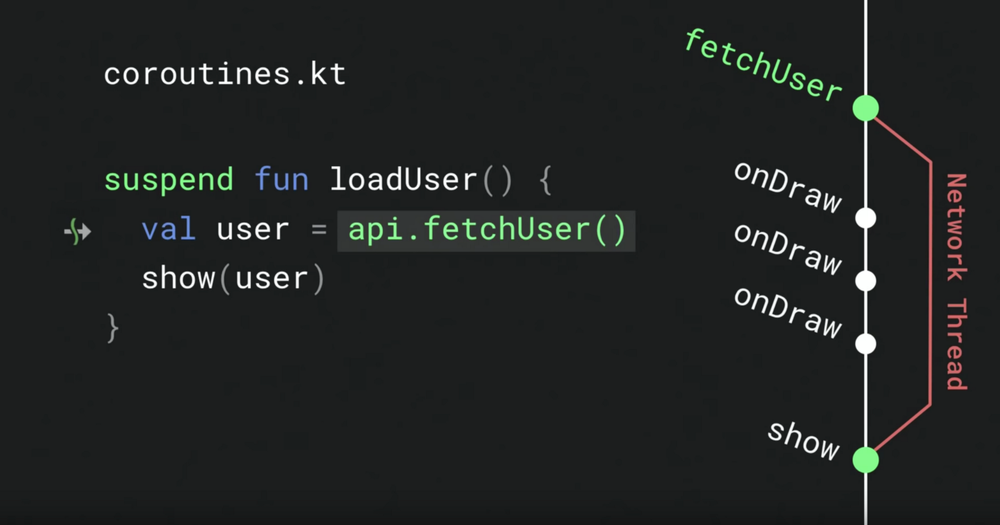

# Kotlin Jetpack Android
Ejemplo de implementar poco a poco Jetpack Android en Kotlin

- [Kotlin Jetpack Android](#kotlin-jetpack-android)
  - [Acerca de](#acerca-de)
  - [Android Jetpack](#android-jetpack)
  - [View Binding](#view-binding)
  - [View Model](#view-model)
  - [Live Data](#live-data)
  - [Coroutines](#coroutines)
  - [Autor](#autor)
    - [Contacto](#contacto)
  - [Licencia](#licencia)
        - [Agradecimientos](#agradecimientos)

## Acerca de
El siguiente proyecto tiene como objetivo acercar cómo implementar Jetpack Android en Kotlin.

El proyecto consiste en la colección de películas con almacenamiento, favoritos, consultas a api rest e inyección de dependencias.

## Android Jetpack
Jetpack es un conjunto de bibliotecas que ayuda a los desarrolladores a seguir las prácticas recomendadas, reducir el código estándar y escribir código que funcione de manera coherente en los dispositivos y las versiones de Android para que puedan enfocarse en el código que les interesa.

Más información en: 
- https://developer.android.com/jetpack
- https://developer.android.com/topic/libraries/architecture?hl=es-419

## View Binding

La vinculación de vista es una función que te permite escribir más fácilmente código que interactúa con las vistas. Una vez que la vinculación de vista está habilitada en un módulo, genera una clase de vinculación para cada archivo de diseño XML presente en ese módulo. Una instancia de una clase de vinculación contiene referencias directas a todas las vistas que tienen un ID en el diseño correspondiente. En la mayoría de los casos, la vinculación de vistas reemplaza a ***findViewById***.

La vinculación de vistas tiene ventajas importantes frente al uso de findViewById:

- Seguridad nula: Debido a que la vinculación de vista crea referencias directas a las vistas, no hay riesgo de una excepción de puntero nulo debido a un ID de vista no válido. Además, cuando una vista solo está presente en algunas configuraciones de un diseño, el campo que contiene su referencia en la clase de vinculación se marca con @Nullable.
- Seguridad de tipos: Los campos de cada clase de vinculación tienen tipos que coinciden con las vistas a las que hacen referencia en el archivo XML. Esto significa que no hay riesgo de una excepción de transmisión de clase.
Estas diferencias significan que las incompatibilidades entre tu diseño y tu código harán que falle la compilación durante el momento de compilación en lugar de hacerlo en el tiempo de ejecución.

Más información: https://developer.android.com/topic/libraries/view-binding

## View Model
ViewModel nos permite almacenar y administrar datos relacionados con la IU de manera optimizada para los ciclos de vida y con ello realizar una vinculación entre los datos y su representación en la interfaz y con ellos implementar el patrón MVVM. Es responsable de preparar y manejar estados para la UI. Tiene una relación directa con la vista para
mostrar los datos. Mediante el uso de ViewModel seremos capaces de desacoplar la lógica de presentación de los componentes de UI.

La vista espera un estado de UI proporcionado por ViewModel y, a su vez, ViewModel podrá actualizar dicho estado de UI si se producen eventos desde la vista. En resumen, la vista podrá recibir actualizaciones del estado de UI desde el ViewModel.

Más información: https://developer.android.com/topic/libraries/architecture/viewmodel?hl=es-419

## Live Data
LiveData es una clase de contenedor de datos observable. LiveData está optimizado para ciclos de vida, lo que significa que respeta el ciclo de vida de otros componentes de las apps, como actividades, fragmentos o servicios. 

Permite que otros componentes se suscriban a él con el fin de ser notificados si se produce algún cambio. Contiene un estado y su principal responsabilidad es avisar a sus
suscriptores cuando dicho estado cambie.

Fragments y Activities pueden suscribirse a un componente LiveData para ser notificados siempre que se produzca una actualización. Si se produce un evento y los datos relacionados con el componente LiveData cambian, los Fragments y Activities suscritos a él serán
notificados al mismo tiempo. LiveData está pendiente del ciclo de vida de Activities y Fragments. Si estos van a un estado onDestroy el componente LiveData cierra y destruye la conexión con ellos automáticamente.

De esta manera combinando LiveData con ViewModel, podremos observar los datos de la vista y el ViewModel en tiempo real y aplicar patrones reactivos.

Más información: https://developer.android.com/topic/libraries/architecture/livedata?hl=es-419

## Coroutines
Coroutines es una biblioteca de Kotlin que permite la ejecución de código asíncrono en una manera más eficiente. En Android, las corrutinas ayudan a administrar tareas de larga duración que, de lo contrario, podrían bloquear el subproceso principal y hacer que tu app dejara de responder. Los componentes optimizados para ciclos de vida proporcionan compatibilidad de primer nivel con las corrutinas para alcances lógicos de tu app, junto con una capa de interoperabilidad con LiveData Nos ofrecen:
- Ligereza: Puedes ejecutar muchas corrutinas en un solo subproceso debido a la compatibilidad con la suspensión, que no bloquea el subproceso en el que se ejecuta la corrutina. La suspensión ahorra más memoria que el bloqueo y admite muchas operaciones simultáneas.
- Menos fugas de memoria: Usa la simultaneidad estructurada para ejecutar operaciones dentro de un alcance.
- Compatibilidad con cancelación incorporada: Se propaga automáticamente la cancelación a través de la jerarquía de corrutinas en ejecución.
- Integración con Jetpack: Muchas bibliotecas de Jetpack incluyen extensiones que proporcionan compatibilidad total con corrutinas. Además, algunas bibliotecas proporcionan su propio alcance de corrutina, que puedes usar para la simultaneidad estructurada.

Más información: https://developer.android.com/kotlin/coroutines?hl=es-419
## Autor

Codificado con :sparkling_heart: por [José Luis González Sánchez](https://twitter.com/joseluisgonsan)

### Contacto

  Cualquier cosa que necesites házmelo saber por si puedo ayudarte 💬.

     &nbsp;&nbsp;
     &nbsp;&nbsp;
      &nbsp;&nbsp;
    

## Licencia

Este proyecto está licenciado bajo licencia **MIT**, si desea saber más, visite el fichero [LICENSE](./LICENSE) para su uso docente y educativo.

##### Agradecimientos
Proyecto basado en el curso de Openwebinars: Curso de Android Jetpack Architecture